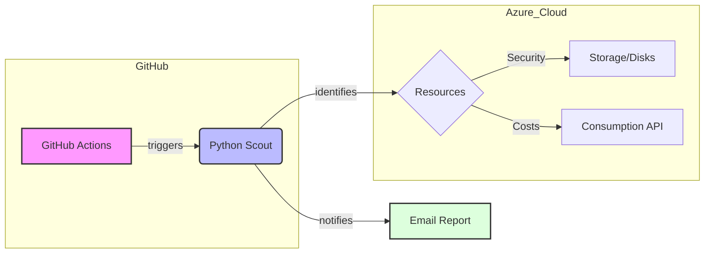
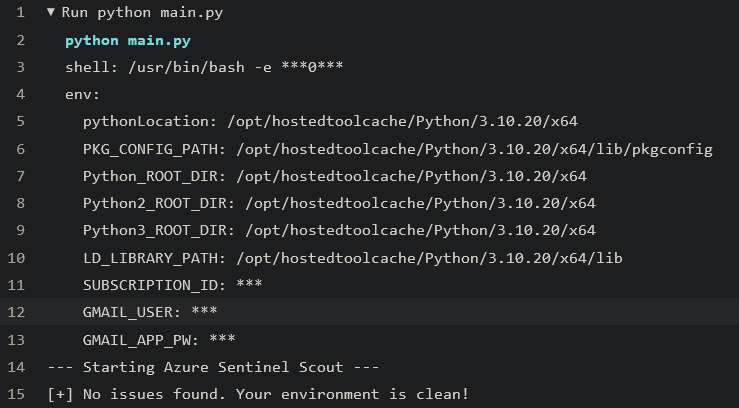
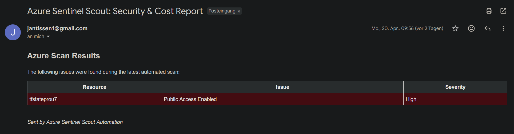

# 🛡️ Azure Sentinel Scout 
### Cloud Governance & Security Automation Suite

**Azure Sentinel Scout** ist eine automatisierte Lösung zur Überwachung von Cloud-Infrastrukturen. Das Tool adressiert zwei kritische Herausforderungen im Cloud-Management: **Sicherheit (Compliance)** und **Kostenoptimierung (FinOps)**. Durch die Integration in eine CI/CD-Pipeline (GitHub Actions) ermöglicht es ein kontinuierliches Audit ohne zusätzliche Infrastrukturkosten.

---

## 📋 Leistungsmerkmale (Key Features)

### 🔒 Security Auditing & Compliance
- **Public Access Detection:** Automatischer Scan von Azure Storage Accounts auf unbefugten öffentlichen Zugriff.
- **Resource Monitoring:** Identifikation von Sicherheitslücken in der Ressourcen-Konfiguration.

### 💰 FinOps & Kostenoptimierung
- **Orphaned Resources:** Automatische Erkennung von ungenutzten (unattached) Managed Disks zur Reduzierung von "Waste".
- **Runtime Monitoring:** Überwachung von virtuellen Maschinen (VMs) auf unerwünschte Laufzeiten außerhalb der Geschäftszeiten (z.B. Wochenende).
- **Executive Cost Summary:** Monatliche Kostenaggregation via Azure Consumption API zur Budget-Transparenz.

---

## 🛠️ Technische Architektur

Das System folgt einem serverlosen Architektur-Ansatz und nutzt moderne Cloud-Automatisierungs-Muster:

⚙️ Tech Stack

    Sprache: Python 3.10+

    SDKs: azure-mgmt-compute, azure-mgmt-storage, azure-mgmt-consumption, azure-identity

    Orchestrierung: GitHub Actions (YAML)

    Authentifizierung: Service Principal mit RBAC (Role-Based Access Control)

    Reporting: HTML5 / SMTP Integration

🚀 Deployment & Konfiguration
1. Azure Identity Management

Erstellen Sie einen Service Principal mit dem Prinzip der geringsten Berechtigung (Least Privilege):

az ad sp create-for-rbac --name "SentinelScoutService" --role reader --scopes /subscriptions/{sub_id} --sdk-auth

2. GitHub Secrets (CI/CD)

Für den Betrieb werden folgende verschlüsselte Umgebungsvariablen benötigt:

    AZURE_CREDENTIALS: Authentifizierungs-Token (JSON)

    GMAIL_APP_PW: Verschlüsselter API-Zugang für das Reporting

    AZURE_SUBSCRIPTION_ID: Ziel-Infrastruktur ID

📊 Business Impact

Durch den Einsatz von Azure Sentinel Scout kann in Firmenumgebungen:

    Cloud-Kosten durch Identifikation verwaister Ressourcen um bis zu 15% gesenkt werden.

    Sicherheitsrisiken durch sofortige Erkennung von Public-Endpoints minimiert werden.

    Manueller Audit-Aufwand durch vollständige Automatisierung eliminiert werden.

Wenn es keine Meldung gibt, wird keine Mail verschickt:

Sollte beim Scan etwas gefunden werden, bekommen wir eine E-Mail:
